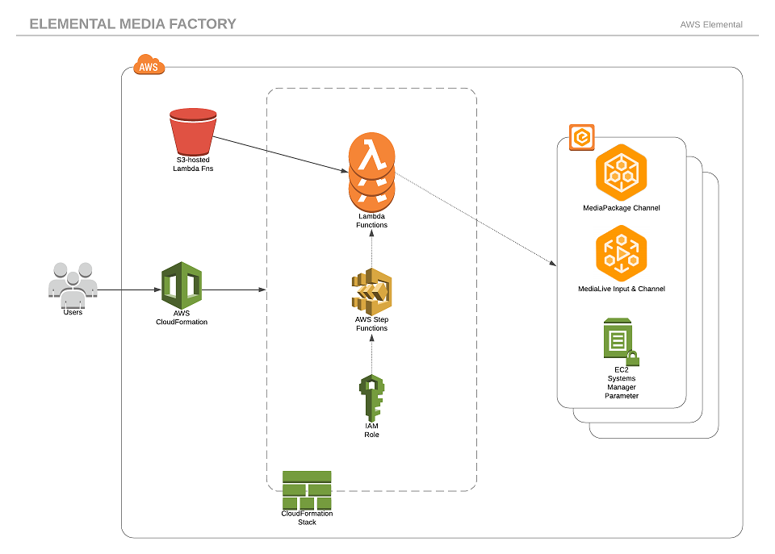

# AWS Elemental Media Services Factory

Used to write AWS Step Functions state machines that stitch together Elemental Media Services.

## What is this?

Media Services Factory can be used to write [AWS Step Functions](https://console.aws.amazon.com/states) state machines that stitch together AWS Elemental Media Services resources into complex video workflows. Once setup, this enables you to create an end-to-end video workflow of your choosing with the push of a button.

## Why would I use this?

It's complex, as well as tedious, to stand up a complete end-to-end production video workflow in testing or production--sometimes taking hours if not days to configure completely. This package allows you to templatize those workflows, standing up those resources pre-configured to suit your needs, in much less time than it would take for a human to do those tasks, and in an automatable way.

## How do I use it?

You must have an AWS developer account, log into the AWS console, and then [follow the install instructions](docs/INSTALL.md).

The basic workflow is:
- Execute CloudFormation template
- Run a step function to create the media resources
- Play back your channel!

The CloudFormation template will deploy all the necessary permissions, Lambda functions, and two sample Step Function state machines that you can use as an example to follow [to create your own custom workflows](docs/ADVANCED.md#lambda-functions).

## Where do I start?

[Start right here!](docs/INSTALL.md)

Once you're done with the that, take a look at [the advanced configuration and developer notes](docs/ADVANCED.md).

## License Summary

This sample code is made available under a modified MIT license. See the [LICENSE file](./LICENSE).
